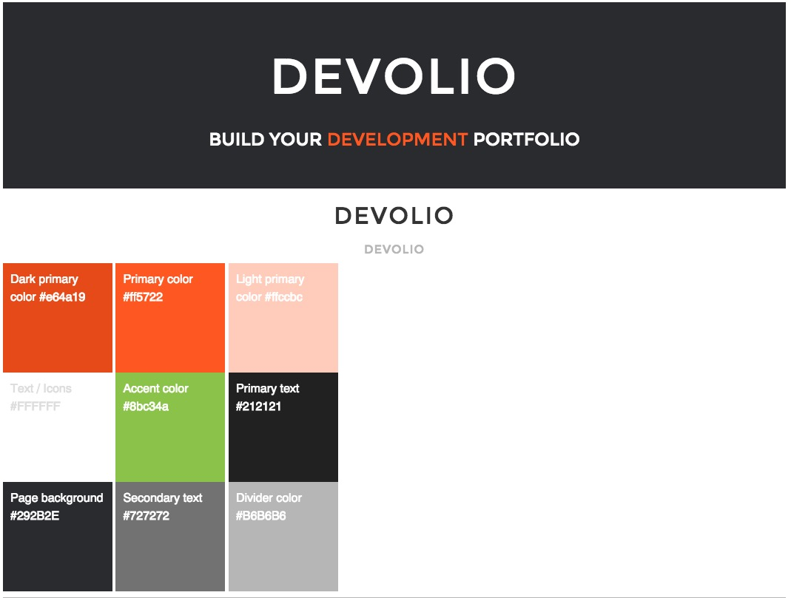
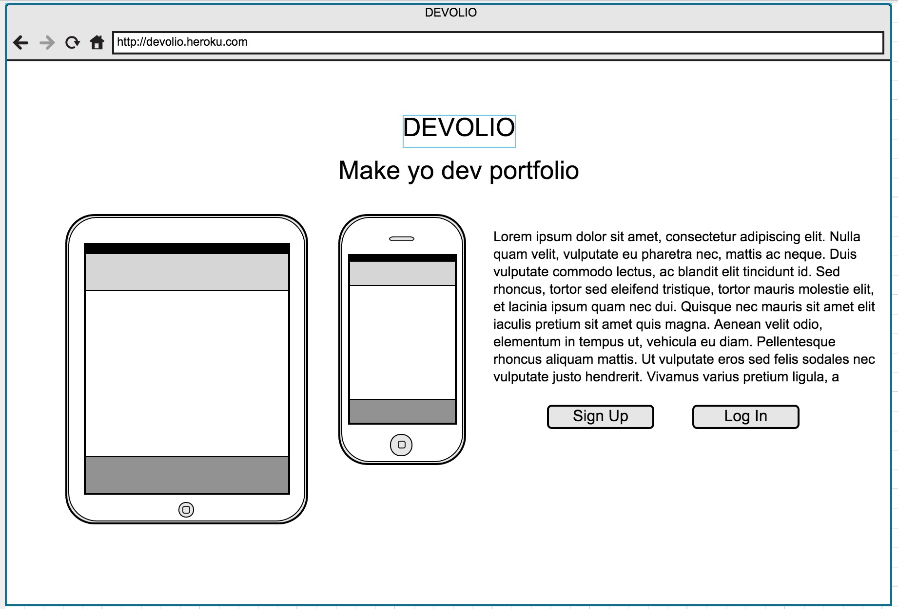
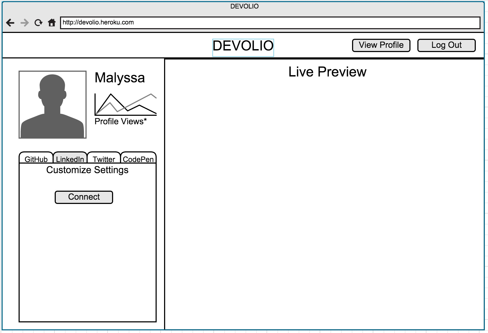
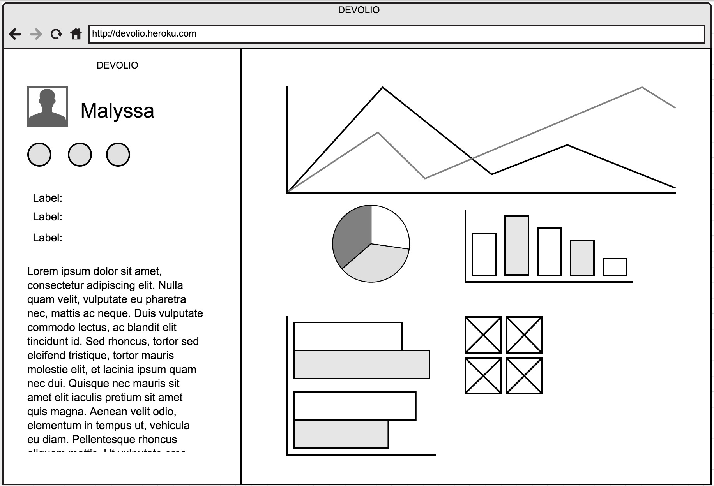
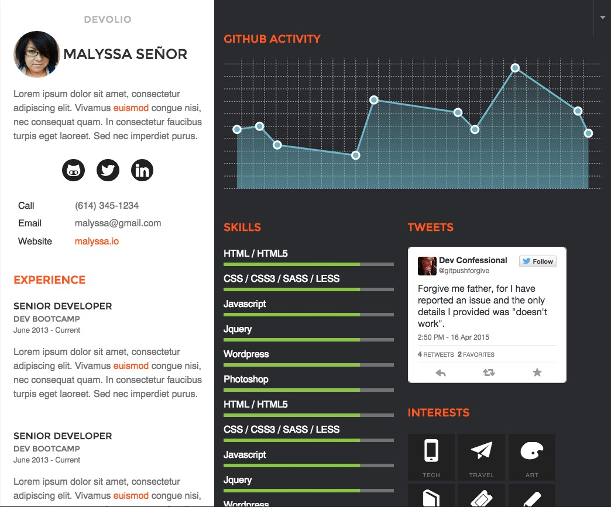

# DEVOLIO

 | 

Build yo dev portfolio! Brought to you by The Architects, DevBootcamp students in the Columbus, Ohio Localhost pilot program.

[Jonathan Roger](https://github.com/jroger2908) | [Mary Baylis](https://github.com/MaryCBaylis) | [Chris Singer](https://github.com/secade) | [Jan Dennison](https://github.com/jannypie)

---
The dev community often focuses less on traditional resumes and more on GitHub activity and project experience. However, HR departments and recruiters are still oriented towards the formal resume model. And look, searching for a job is a hard thing in general - juggling different information and audiences shouldn't be part of it.

*DEVOLIO* merges LinkedIn resume information with your GitHub account activity to quickly and easily produce an attractive, informative job search profile. Additionally, the dev community is centralized around Twitter, so you can also show your Twitter stream and have it curated to only bring in specific keywords. Check it out!

---

[Project Goals](#goals) | [Technologies](#tech) | [Visual Guide](#visual) | [Wireframes](#wireframes)

---

## Project Goals
- Complete MVP is important
- 80% minimum test coverage, attempt TDD for portions
- Responsive front end for sharing on mobile devices
- Continuous integration and automated deployment

### Group goals
- Honest and timely feedback and communication among group members
- Ask for help when stuck (err on the side of asking)
- Flexible workflows: pairing and individual, mix it up
- Support working from homes at least one day over the weekend
- Flexible on working early vs working late (asyncronously)
- Sunday afternoon off, Team Retro #1 on Sunday evening

### User Stories
As a DevRes Builder user, I want to:
- Create an account, Edit, Delete
- Sign in / sign out
- Connect my GitHub account
  - Twitter
  - LinkedIn
- Have a public-facing profile resume built (/username)
- Import/Display my (curated) recent Tweets
- Import/Display my (curated) Github/LinkedIn information

### MVP Goals
- Meet user story features

### Stretch Goals
- See Google Analytics statistics on my public profile
- Multiple Resumes
- Additional service API integration
  - CodePen
  - Dribbble
- Custom URL (default to username)
- Export to PDF
- Printable CSS
- Email integration

## Technologies
- Ruby on Rails with ~~Postgres~~ MongoDB
- MongoDB, managed through Mongoid ODM library
- Backbone.JS for front-end MVC
- RSpec testing on Ruby
- Jasmine testing on front end
- Responsive Bootstrap framework, customized
- CSS/Sass
- Team communication through Slack
- Project management through Trello

### Tech Spikes
Technologies to research for the project:
- APIs
  - Google Analytics
  - GitHub
  - Twitter
  - LinkedIn
- Stacks
  - AWS
- Client-side JS Frameworks
  - Backbone
  - Angular
  - Meteor
- Testing
  - Cucumber
- Other
  - Devise
  - D3
  - Octokit
- Added
  - MongoDB, MongoID

## Visual Guide
Colors, fonts, general idea gathering.

## Wireframes
Overall direction of UI design.

Index

User Dashboard: Option 1

User Dashboard: Option 2

User public profile

User public profile mockup

